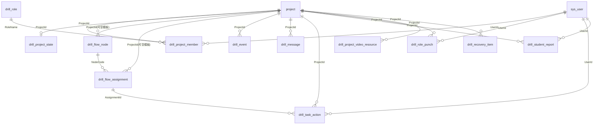

# 数据字典（DB 阶段产出）

## 1. 依据与范围

- 数据来源：`DB/mysql/vol-db.sql`（主）、`DB/mysql/mysql表结构与表数据.sql`（历史版本，表名多为大写驼峰）。
- 本次“确定数据字典”以 `vol-db.sql` 为准（共 `47` 张表）。
- 重点覆盖当前项目核心业务：**演练模块（drill_*) + 项目管理（project）+ 用户基础（sys_user）**。

## 2. 逻辑分域与表清单

- **演练域（12）**
  - `drill_event`
  - `drill_flow_assignment`
  - `drill_flow_node`
  - `drill_message`
  - `drill_project_member`
  - `drill_project_state`
  - `drill_project_video_resource`
  - `drill_recovery_item`
  - `drill_role`
  - `drill_role_punch`
  - `drill_student_report`
  - `drill_task_action`
- **项目域（2）**
  - `project`
  - `projectmember`（已被 `drill_project_member` 逐步替代）
- **交易示例域（2）**
  - `sellorder`
  - `sellorderlist`
- **系统与权限域（其余）**
  - `sys_user`, `sys_role`, `sys_menu`, `sys_department`, `sys_workflow*`, `sys_table*` 等。

## 3. 关系图（核心业务 ER）

## 4. 核心表字段字典（可直接用于设计说明）

### 4.1 `project`（项目主表）

- `Id` int, PK, 自增：项目主键。
- `Name` varchar(200), not null：项目名称。
- `Code` varchar(50), not null：项目编号（学员登录/注册使用）。
- `Status` int, default 0：项目状态。
- `Remark` varchar(500)：备注。
- 审计字段：`CreateDate/CreateID/Creator/ModifyDate/ModifyID/Modifier`。

### 4.2 `drill_project_member`（项目成员/学员）

- `Id` bigint, PK, 自增。
- `ProjectId` int, not null：所属项目。
- `UserId` int, null：关联 `sys_user.User_Id`。
- `UserName` varchar(50), not null：系统用户名。
- `RoleName` varchar(50), not null：演练身份组名称。
- `UserTrueName` varchar(50)：真实姓名。
- `Org` varchar(200)：单位。
- `JobTitle` varchar(100)：职务。
- `Contact` varchar(100)：联系方式。
- `Photo` varchar(500)：照片 URL。
- `AuditStatus` int, default 0：`0待审核 1通过 2拒绝`。
- `SignedAt` datetime：签到时间。
- `CreateDate/ModifyDate`：创建和修改时间。
- 约束：`UX_drill_project_member_Project_User(ProjectId,UserName)`。

### 4.3 `drill_role`（身份组模板）

- `Id` bigint, PK。
- `RoleNo` varchar(50)：角色编号。
- `RoleName` varchar(50), unique：角色名称（成员表引用）。
- `Avatar` varchar(500)：头像地址。
- `TaskBookJson` text：角色任务书 JSON。
- `Enable` int, default 1：启用标识。
- `CreateDate/ModifyDate`：审计时间。

### 4.4 `drill_project_state`（项目运行状态机）

- `Id` bigint, PK。
- `ProjectId` int, unique：每项目唯一一条状态记录。
- `Status` int, default 0：`0未开始 1运行中 2暂停 3已结束`。
- `CurrentStage` varchar(50)：阶段（如 scene/report/recovery/end）。
- `CurrentNodeCode` varchar(50)：当前流程节点编码。
- `StartedAt/PausedAt/EndedAt`：关键时间点。
- `ElapsedSeconds` int：累计运行秒数。
- `LastResumedAt` datetime：最近恢复运行时间。
- `SettingsJson` text：运行设置。

### 4.5 `drill_flow_node`（流程节点定义）

- `Id` bigint, PK。
- `ProjectId` int, null：`null=全局模板`，非空=项目覆盖。
- `NodeCode` varchar(50), not null：节点编码。
- `NodeName` varchar(100), not null：节点名称。
- `Stage` varchar(50), not null：业务阶段。
- `OrderNo` int：节点顺序。
- `NextNodeCode` varchar(50)：后继节点编码。
- `Description` text：节点描述。
- `VideoStartSeconds/VideoEndSeconds` int：节点对应视频时间段。
- `Enable` int：启用标识。

### 4.6 `drill_flow_assignment`（节点任务卡）

- `Id` bigint, PK。
- `ProjectId` int, null：模板/项目覆盖机制同节点表。
- `NodeCode` varchar(50), not null：归属节点。
- `RoleName` varchar(50), not null：执行身份组。
- `TaskTitle` varchar(200), not null：任务标题。
- `TaskDetail` text：任务说明。
- `StepsJson` text：步骤 JSON。
- `SubmitType` varchar(30)：提交类型（text/image/voice/checklist）。
- `EvidenceRequired` int：是否必须证据。
- `OrderNo` int：排序号。
- `Enable` int：启用标识。

### 4.7 `drill_task_action`（任务执行记录）

- `Id` bigint, PK。
- `ProjectId` int, not null。
- `NodeCode` varchar(50), not null。
- `AssignmentId` bigint：对应任务卡。
- `RoleName` varchar(50)：提交角色。
- `TaskTitle` varchar(200)：任务标题快照。
- `StepResultJson` text：步骤完成结果。
- `TextContent` text：文本描述。
- `EvidenceJson` text：证据（图片/文件等）结构化数据。
- `Status` int, default 1：`1已提交 2已审核/通过`。
- `UserId/UserName`：提交人。
- `OccurAt/CreateDate`：发生/创建时间。

### 4.8 `drill_event`（事件时间线）

- `Id` bigint, PK。
- `ProjectId` int, not null。
- `Stage` varchar(50), not null：stage 维度。
- `EventType` varchar(50), not null：`system/teacher/student`。
- `Title` varchar(200)：事件标题。
- `Content` text：事件内容。
- `OccurAt` datetime：业务发生时间（可编辑）。
- `UserId/UserName/RoleName`：记录人信息。
- `CreateDate`：落库时间。

### 4.9 `drill_message`（讨论消息）

- `Id` bigint, PK。
- `ProjectId` int, not null。
- `Channel` varchar(50), not null：`discussion/speech`。
- `Content` text, not null：消息正文。
- `UserId/UserName/RoleName`：发送人信息。
- `CreateDate`：发送时间。

### 4.10 `drill_role_punch`（角色任务书打卡）

- `Id` bigint, PK。
- `ProjectId` int, not null。
- `RoleName` varchar(50), not null。
- `UserId` int, not null。
- `UserName/UserTrueName`：姓名信息。
- `PunchAt` datetime：打卡时间。
- `ContentJson` text：打卡内容（勾选项）。
- `CreateDate` datetime。
- 唯一约束：`UX_drill_role_punch_once(ProjectId,RoleName,UserId)`（每项目每角色每人仅一次）。

### 4.11 `drill_student_report`（学员总结与批阅）

- `Id` bigint, PK。
- `ProjectId` int, not null。
- `UserId/UserName/UserTrueName/RoleName`：提交人信息。
- `ReportType` varchar(30), not null：`report/recovery`。
- `Title` varchar(200)：标题。
- `Content` text：正文。
- `ExtraJson` text：扩展数据。
- `SubmitStatus` int, default 1：`1已提交 2已批阅`。
- `ReviewScore` int：评分。
- `ReviewComment` varchar(1000)：评语。
- `ReviewerId/ReviewerName/ReviewAt`：批阅人信息。
- `CreateDate/ModifyDate`：审计时间。

### 4.12 `drill_project_video_resource`（项目视频资源）

- `Id` bigint, PK。
- `ProjectId` int, not null。
- `ResourceName` varchar(200)：资源名称。
- `VideoUrl` varchar(500), not null：视频地址。
- `Enable` int：是否启用。
- `CreateDate/ModifyDate`：审计时间。

### 4.13 `drill_recovery_item`（恢复事项清单）

- `Id` bigint, PK。
- `ProjectId` int, not null。
- `Category` varchar(50), not null：如 `cleanup/order/claim/investigation`。
- `Title` varchar(200), not null：事项标题。
- `Status` int, default 0：`0未完成 1已完成`。
- `Note` varchar(500)：备注。
- `OrderNo` int：排序。
- `ModifyDate/Modifier`：处理信息。

### 4.14 `sys_user`（用户主表，摘要）

- `User_Id` int, PK：用户主键。
- `UserName` varchar：账号。
- `UserPwd` varchar：密码密文。
- `UserTrueName` varchar：姓名。
- `Role_Id/RoleName`：系统角色。
- `Enable`：启用状态。
- 其余为部门、电话、审计字段。

## 5. 关键数据标准（建议写入需求/设计文档）

- **统一主键风格**：业务新表统一 `bigint Id` 自增。
- **统一审计字段**：建议统一 `CreateDate/CreateID/Creator/ModifyDate/ModifyID/Modifier`。
- **状态枚举统一**：
  - `drill_project_state.Status`: `0/1/2/3`。
  - `drill_project_member.AuditStatus`: `0/1/2`。
  - `drill_student_report.SubmitStatus`: `1/2`。
  - `drill_task_action.Status`: `1/2`。
- **模板覆盖机制统一**：`ProjectId IS NULL` 代表全局模板，非空代表项目级覆盖（见 `drill_flow_node`、`drill_flow_assignment`）。
- **跨表文本关联注意点**：`RoleName`、`NodeCode` 属于逻辑外键（非物理 FK），需在应用层保持一致性。

## 6. 可作为“确定数据字典”阶段交付的内容

- 已完成：
  - 表分域与清单
  - 核心实体字段定义
  - 枚举值与约束说明
  - 核心 ER 图
- 下一步建议：
  - 补一份“全量 47 表字段清单（自动导出版）”
  - 对 `RoleName/NodeCode` 增加字典表或物理外键约束策略说明
  - 输出接口字段映射（DB 字段 -> API 返回字段）
